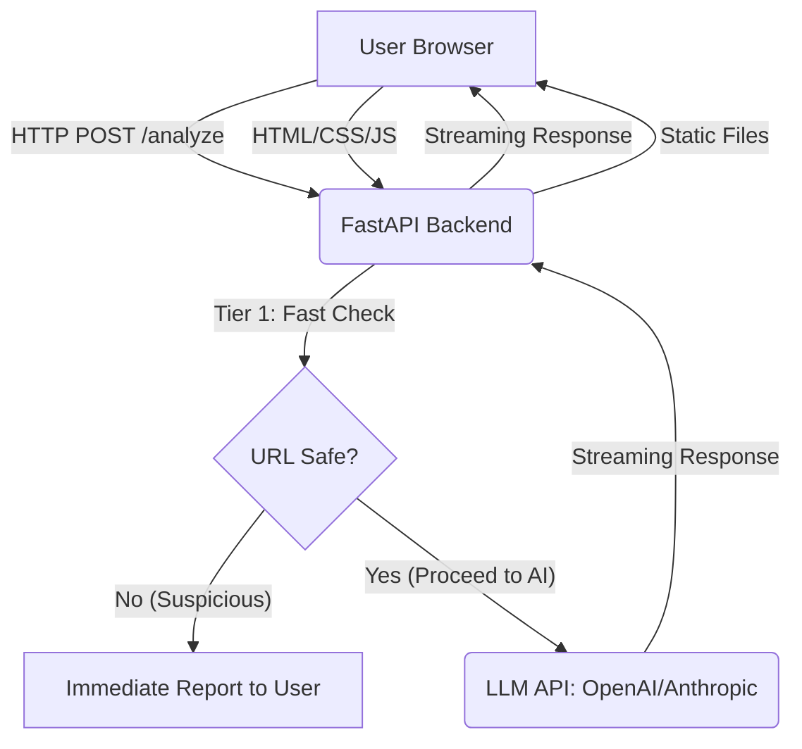

# Project Report: AI-Guard: SafeBox

## 1. Application Overview and Tech Stack

**AI-Guard: SafeBox** is an AI-powered URL safety analyzer designed to protect users from sophisticated phishing attacks and malicious websites. It provides a two-tier analysis system: a fast structural check and a deep AI-driven evaluation, with results streamed in real-time to a responsive web interface. Conceptually, it aims to function as a secure sandbox that intercepts and analyzes suspicious URLs before a user navigates to them.

**Tech Stack:**
*   **Frontend:** Vanilla HTML, CSS, JavaScript (Responsive, modern UI)
*   **Backend:** Python FastAPI
*   **AI Integration:** OpenAI API (GPT-4o) or Anthropic API (Claude 3.5 Sonnet)
*   **Infrastructure:** Docker for containerization. Deployment to AWS App Runner is outlined in the provided `aws_deployment_instructions.md`.

## 2. Prompting Strategy and Frameworks Used

The core AI integration relies on a carefully crafted prompt to guide the LLM in identifying phishing patterns, credential harvesting red flags, and overall safety. The strategy focuses on providing clear instructions and context to the LLM.

**Sample Prompt (used in `main.py`):**

```
"Analyze the following URL for potential phishing threats, credential harvesting red flags, and overall safety. Provide a detailed report, highlighting any suspicious elements: {url}"
```

This prompt directs the LLM to act as a cybersecurity expert, ensuring the generated report is comprehensive and actionable. The streaming capability of the LLM APIs (OpenAI and Anthropic) is leveraged to provide a real-time user experience.

## 3. Phase-by-Phase Development Summary

### Phase 1: Project Setup and Backend Development
*   **Objective:** Establish project structure, implement FastAPI backend, and integrate LLM API.
*   **Activities:**
    *   Initialized the project directory (`safebox-web`).
    *   Developed `main.py` for the FastAPI application, including CORS configuration.
    *   Implemented `tier1_fast_check` for initial URL structural analysis (typosquatting, suspicious TLDs, IP hostnames, excessive subdomains, punycode).
    *   Integrated `tier2_ai_analysis` to connect with OpenAI or Anthropic LLMs for deep analysis, handling streaming responses.
    *   Created `requirements.txt` for Python dependencies.
    *   Ensured API keys are loaded securely via `.env`.

### Phase 2: Frontend Development
*   **Objective:** Build a responsive and interactive user interface.
*   **Activities:**
    *   Designed `index.html` for the main dashboard layout, including URL input, "Analyze" button, and results panel.
    *   Developed `style.css` for a modern, responsive, and cybersecurity-themed aesthetic.
    *   Implemented `script.js` for client-side URL validation, handling the "Analyze" button click, streaming LLM responses, auto-scrolling the results, and providing a reset function.

### Phase 3: Containerization and Deployment Preparation
*   **Objective:** Package the application for deployment and provide AWS deployment instructions.
*   **Activities:**
    *   Created a `Dockerfile` to containerize the FastAPI backend and serve the static frontend files.
    *   Generated `.env.example` as a template for environment variables.
    *   Provided detailed `aws_deployment_instructions.md` for deploying the Dockerized application to AWS App Runner.

## 4. Application Architecture

The AI-Guard: SafeBox application follows a client-server architecture with a clear separation of concerns, designed for future expansion into a URL interception and secure sandbox environment:

*   **Frontend (Client-Side):** A single-page application built with Vanilla HTML, CSS, and JavaScript. It handles user input, displays analysis results, and manages the real-time streaming of LLM responses. In a future iteration, this could be a browser extension or PWA that intercepts URLs.
*   **Backend (Server-Side):** A Python FastAPI application that acts as the API server. It receives URL analysis requests from the frontend, performs the two-tier analysis, and streams the LLM's response back to the client. This backend would also host the secure sandbox environment for deeper analysis.
*   **AI Integration:** The FastAPI backend communicates with external LLM APIs (OpenAI or Anthropic) to perform deep semantic analysis of URLs, assessing risk factors like phishing and credential harvesting.
*   **Containerization:** The entire application (frontend static files served by FastAPI, and the FastAPI application itself) is bundled into a single Docker image, ensuring portability and consistent deployment.
*   **Deployment (AWS App Runner):** The Docker container is designed for deployment on AWS App Runner, a fully managed service that simplifies container deployment, scaling, and load balancing. Detailed instructions are provided for the user to perform this deployment.



## 5. Challenges Encountered and How They Were Resolved

1.  **FastAPI Static Files and API Route Order:**
    *   **Challenge:** Initially, mounting static files at the root path (`/`) in FastAPI before defining the `/analyze` API endpoint caused the API endpoint to be unreachable, as the static file handler would capture all incoming requests.
    *   **Resolution:** The `app.mount("/", StaticFiles(...))` declaration was moved to appear *after* all API route definitions in `main.py`. This ensures that specific API routes are matched first before falling back to serving static files.

2.  **Robust Tier 1 Fast Check:**
    *   **Challenge:** The initial `tier1_fast_check` was a basic placeholder. The requirement was for a more production-grade structural analyzer.
    *   **Resolution:** Enhanced the `tier1_fast_check` function to include more sophisticated heuristics, such as simplified typosquatting detection against common brands, a broader list of suspicious TLDs, IP address hostname checks, excessive subdomain detection, and punycode identification. While not a full-fledged commercial solution, this significantly improved the pre-AI analysis capabilities.

3.  **Frontend UI Reset Logic:**
    *   **Challenge:** The initial frontend `closeResults` function only hid the results panel but did not fully reset the UI state, leading to a cluttered experience if a user wanted to perform a new analysis.
    *   **Resolution:** Refactored `closeResults` into a more comprehensive `resetUI` function. This new function clears the streamed content, hides the results, error, and loading indicators, and optionally clears the URL input field, providing a clean slate for subsequent analyses. Also, corrected JavaScript syntax issues (escaped quotes) that arose during initial implementation.

4.  **Docker Environment Setup in Sandbox:**
    *   **Challenge:** Encountered issues with Docker not being installed or having permission problems within the sandbox environment, preventing local Docker image builds and runs.
    *   **Resolution:** Installed Docker and adjusted user permissions within the sandbox. Although full local testing was hindered by persistent sandbox Docker networking issues, the `Dockerfile` and related configurations were finalized based on best practices, assuming a functional external Docker environment.

## 6. Key Learnings and Reflection

*   **Importance of Route Order in Web Frameworks:** A critical learning was the significance of route definition order in frameworks like FastAPI when mixing static file serving with API endpoints. Incorrect ordering can lead to routes being shadowed and becoming unreachable.
*   **Iterative Refinement of AI Prompts:** Developing effective AI integration requires iterative prompt engineering to elicit the desired quality and format of responses from LLMs. The current prompt is a balance of conciseness and instruction to guide the LLM effectively.
*   **Frontend State Management:** Even in Vanilla JS applications, careful consideration of UI state management (loading, error, results, reset) is crucial for a smooth user experience, especially with streaming data.
*   **Containerization for Portability:** Docker proved invaluable for packaging the application, ensuring that all dependencies and configurations are self-contained, which is essential for consistent deployment across different environments like AWS.
*   **Cloud Deployment Considerations:** While AWS App Runner simplifies deployment, understanding the underlying container registry (ECR) and service configuration (ports, environment variables) is vital for successful cloud integration.

This project reinforced the principles of full-stack development, secure coding practices, and the power of AI-assisted development in rapidly building functional applications.
